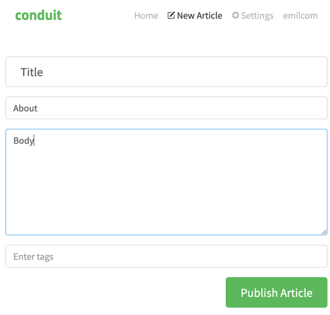
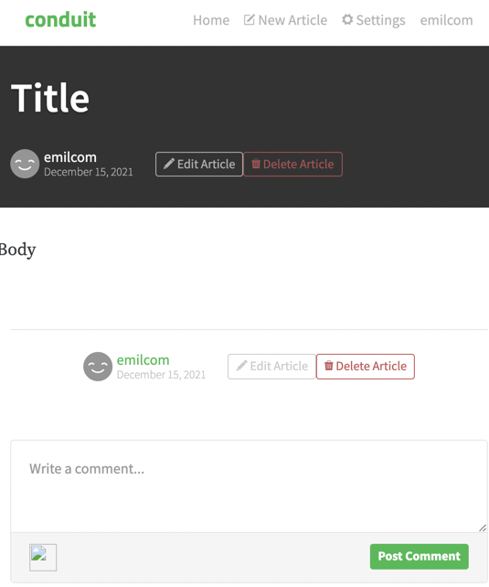

Summary: Article's About data is not displayed
* Environment: https://qa-task.backbasecloud.com/
* Requirement: some kind of artifact that mandates this field
> In general, bug/defect is a function of some kind of story/requirement. If something is missing, but was never requested, this is not a bug of software but missing requirement.
* Priority: Major
> 1/3 of data is missing, so Major is a good choice but not higher, nothing else is impacted.
* Steps to reproduce:
  * login to the application
  * publish new article with all fields specified
* Expected result:
  * all specified fields are visible
* Actual result:
  * Only Title and Body information displayed
* Screenshot: 
> Imagine `About` is highlighted on first image

 
